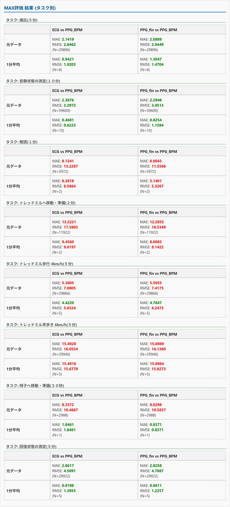

<div id="top"></div>

## 使用技術一覧

<p style="display: inline">
  
  
  
  
  
  
</p>

## 目次

1. [プロジェクトについて](#プロジェクトについて)
2. [環境](#環境)
3. [ディレクトリ構成](#ディレクトリ構成)
4. [主な機能](#主な機能)
5. [設計における工夫と考察](#設計における工夫と考察)
6. [セットアップ](#セットアップ)
7. [開発者情報](#開発者情報)

## プロジェクト名

analysis-mlx-max-1

## プロジェクトについて

本プロジェクトは，Excel (xlsx) や CSV，テキスト形式のデータファイルを読み込み，特定の評価指標（MLX90632，MAX30102のセンサ値評価）に基づいた統計解析および可視化を行うWebアプリケーションです．

特に「時刻」や「持続時間」を含む複雑なデータ形式のパースに対応しており，予測値と実測値の誤差分析（MAE, RMSE）を自動化します．解析結果はインタラクティブなグラフおよびテーブルとして提示され，そのまま画像（PNG）として保存することも可能です．


<p align="right">(<a href="#top">トップへ</a>)</p>

## 環境

| カテゴリ | 項目 | 内容 |
| --- | --- | --- |
| **Backend** | 言語 / フレームワーク | Python / Flask |
| **Libraries** | 解析・統計 | Pandas, NumPy, scikit-learn |
| **Frontend** | ライブラリ | Chart.js, html2canvas, date-fns |
| **通信** | 方式 | 非同期通信 (Fetch API) / CORS対応 |

<p align="right">(<a href="#top">トップへ</a>)</p>

## ディレクトリ構成
```
.
├── app.py           # Flaskバックエンド（Pandasを用いた統計解析・MAE/RMSE算出ロジック）
├── index.html       # フロントエンド（UI構造・解析オプション設定・各種ライブラリロード）
├── script.js        # フロントエンドロジック（データ送信・Chart.js描画・PNG保存処理）
├── style.css        # UIデザイン（デバイスパネル，結果表示ボックス，テーブル装飾）
└── README.md        # 本ファイル
```

<p align="right">(<a href="#top">トップへ</a>)</p>

## 主な機能

### 1. 多彩な解析メニュー
* **ファイル内容表示**: アップロードされたデータのプレビュー機能．
* **MLX / MAX評価**: 指定された列のデータから平均絶対誤差 (MAE) や平方根平均二乗誤差 (RMSE) を算出．
* **MLX修正後評価**: データの補正を加えた上での再評価ロジック．

### 2. 高度なデータパース
* **柔軟な時刻解析**: Excelシリアル値、絶対時刻、`分:秒.ミリ秒` 形式など、多様なフォーマットを正規表現を用いて自動識別・変換します．

### 3. 動的データビジュアライゼーション
* **インタラクティブ・グラフ**: Chart.jsを用いた時系列データの描画．ズーム機能やアノテーション（注釈）に対応．
* **結果の保存**: 解析結果のセクションを `html2canvas` により高解像度PNGとしてエクスポート可能．


<p align="right">(<a href="#top">トップへ</a>)</p>

## 設計における工夫と考察

### 1. 堅牢なデータクリーニング
`app.py` 内で `pandas` の `errors='coerce'` や正規表現を活用したカスタムパーサを実装し，入力データの欠損や表記揺れによるシステムダウンを防ぐ堅牢な設計を行っています．

### 2. 視覚的・直感的な分析体験
統計数値（MAE/RMSE）の提示だけでなく，時系列グラフとテーブルをセットで表示することで，エラーの傾向を視覚的に把握しやすくしています．また，フロントエンドでの非同期並列処理により，複数の解析を同時に実行・表示可能です．

<p align="right">(<a href="#top">トップへ</a>)</p>

<p align="center">
  
</p>

開発者情報
Name: Takato Ishii

Portfolio: https://takato-ishii.vercel.app/

<p align="right">(<a href="#top">トップへ</a>)</p>